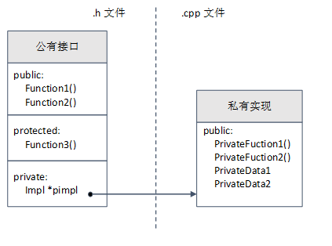
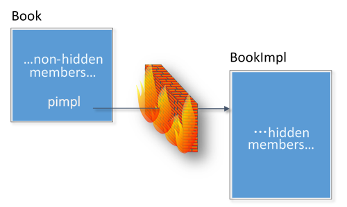

C++ Pimpl编程技巧
=================

C++ Pimpl
---------

**Pimpl(pointer to implementation，指向实现的指针)\ 是一种常用的，用来对“类的接口与实现”进行解耦的方法。**
这个技巧可以避免在头文件中暴露私有细节，是促进API接口与实现保持分离的重要机制。
但是Pimpl并不是严格意义上的设计模式(它是受制于C++特定限制的变通方案)，这种惯用法可以看做桥接设计模式的一种特例。

如上图所示，Pimpl惯用法，\ **公有类拥有一个私有指针，该指针指向隐藏的实现类。**

在类中使用Pimpl惯用法，具有如下优点：

-  降低耦合

-  信息隐藏

-  降低编译依赖，提高编译速度

-  接口与实现分离

假如我们要设计一书籍类\ ``Book``\ ，\ ``Book``\ 包含目录属性，并提供打印书籍信息的接口，\ ``Book``\ 设计如下：

.. code-block:: cpp

    // book.h

    #ifndef BOOK_H
    #define BOOK_H

    class Book
    {
    public:
        void print();

    private:
        std::string m_Contents;
    };

    #endif

``Book``\ 的使用者只需要知道\ ``print()``\ 接口，便可以使用\ ``Book``\ 类，看起来一切都很美好。

然而，当某一天，发现\ ``Book``\ 需要增加一标题属性，对\ ``Book``\ 类的修改如下：

.. code-block:: cpp

    // book.h

    #ifndef BOOK_H
    #define BOOK_H

    class Book
    {
    public:
        void print();

    private:
        std::string m_Contents;
        std::string m_Title;
    };

    #endif

虽然使用\ ``print()``\ 接口仍然可以直接输出书籍的信息，但是Book类的使用者却不得不重新编译所有包含Book类头文件的代码。

为了隐藏\ ``Book``\ 类的实现细节，实现接口与实现的分离，可以使用Pimpl方法。

我们依然对\ ``Book``\ 类提供相同的接口，但\ ``Book``\ 类中不再包含原有的数据成员，其所有的操作都由\ ``BookImpl``\ 类实现。
在\ ``Book``\ 类中定义公共的接口，具体实现在\ ``BookImpl``\ 类中实现，在\ ``Book``\ 类中包含一个指向\ ``BookImpl``\ 类的指针：

.. code-block:: cpp
    :emphasize-lines: 15, 16       

    // book.h

    #ifndef BOOK_H
    #define BOOK_H

    class Book
    {
    public:
        Book();
       ~Book();

       void print();

    private:
        class BookImpl;
        BookImpl *pImpl;
    };

    #endif // BOOK_H

..

   - ``xxx``\ 类定义公共接口，对应的实现类通常命名为\ ``xxxImpl``\ ;

   - 在\ ``Book``\ 类中，需要前置声明\ ``BookImpl``\ 类，声明可以放在\ ``Book``\ 类中，也可以放在类外，通常在类中声明；

在对外的头文件\ ``book.h``\ 中，只包含\ ``Book``\ 类的外部接口，而真正的实现细节被封装到\ ``BookImpl``\ 类。
**为了不对外暴露BookImpl类，将其声明为Book类的内嵌类，并声明为private。**

.. code-block:: cpp
    :emphasize-lines: 10

    // bookimpl.h

    #ifndef BOOKIMPL_H
    #define BOOKIMPL_H

    #include <string>

    #include "book.h"

    class Book::BookImpl
    {
    public:
        void print();

    private:
        std::string content;
        std::string title;
    };

    #endif // BOOKIMPL_H

``bookimpl.h``\ 并不需要提供给\ ``Book``\ 类的使用者，因此，如果往后需要重新设计书籍类的属性，外界对此一无所知，从而保持接口的不变性，并减少了文件之间的编译依赖关系。

.. code-block:: cpp

    // book.cpp

    #include "book.h"
    #include "bookimpl.h"

    #include <iostream>

    Book::Book()
    {
        pImpl = new BookImpl();
    }

    Book::~Book()
    {
        if (pImpl)
            delete pImpl;
        pImpl = nullptr;
    }

    void Book::print()
    {
        pImpl->print();
    }

    /* BookImpl类的实现函数 */
    void Book::BookImpl::print()
    {
        std::cout << "print in impl" << std::endl;
    }

.. note::

   具体的实现，可以放在\ ``book.cpp``\ 中实现，也可以放在单独的\ ``bookimpl.cpp``\ 中。

使用\ ``Book``\ 类的接口的方法如下：

.. code-block:: cpp

    // main.cpp

    #include "book.h"

    int main()
    {
        Book book;
        book.print();

        return 0;
    }

像\ ``Book``\ 类这样使用Pimpl的类，往往被称为\ **handle class**\ ，\ ``BookImpl``\ 类作为实现类，被称为\ **implementation class**\ 。

为简单实现起见，\ ``Book``\ 类省略了复制构造函数和赋值运算符重载函数。
在实际应用中，一般有两种可选方案解决\ ``Book``\ 的复制和赋值的语义问题。

-  禁止复制类

    如果不打算让用户创建对象的副本，那么可以将对象声明为不可复制的。
    可以将复制构造函数和赋值运算符重载函数声明为私有的，这样在复制或者赋值时就会产生编译错误。

    .. code-block:: cpp
        :emphasize-lines: 14, 15

        #ifndef BOOK_H
        #define BOOK_H

        class Book
        {
        public:
            Book();
            ~Book();

            void print();

        private:
            // 禁止复制类
            Book(const Book&);
            const Book &operator=(const Book&);

            class BookImpl;  // Book实现类的前置声明
            BookImpl *pImpl;
        };

        #endif

-  显式定义复制语义

    如果希望用户能够复制采用Pimpl的对象，就应该声明并定义自己的复制构造函数和赋值运算符方重载函数。
    它们可以执行对象的深复制，即创建对象的副本，而非复制指针。

Pimpl惯用法最主要的缺点是，必须为你创建的每个对象分配并释放实现对象，这使对象增加了一个指针，
handle class成员函数的每次调用都必须通过implementation class，这会增加一层间接性。
在实际中你需要对这些开销进行权衡。

另外，采用了Pimpl的对象，编译器将不再捕获const方法中对成员变量的修改。
这是由于成员变量现在存在于独立的对象中，编译器仅检查const方法中的pimpl指针是否发生变化，而不会检查pimpl指向的任何成员。

可以使用下图来说明Pimpl方法在以上Book类设计的作用：

由于pImpl解除了接口与实现之间的耦合关系，从而降低了文件间的编译依赖关系，pImpl也因此常被称为"编译期防火墙"。

Example
-------

cppreference中的例子：

.. code-block:: cpp
    :emphasize-lines: 9, 10, 29

    // widget.h

    #include <iostream>
    #include <memory>
    #include <experimental/propagate_const>

    class widget
    {
        class impl;
        std::experimental::propagate_const<std::unique_ptr<impl>> pImpl;

    public:
        void draw() const;  // public API that will be forwarded to the implementation
        void draw();
        bool shown() const { return true; }  // public API that implementation has to call

        widget(int);
        ~widget();  // defined in the implementation file, where impl is a complete type

        widget(widget&&) = default;  // Note: calling draw() on moved-from object is UB
        widget(const widget&) = delete;
        widget& operator=(widget&&);  // defined in the implementation file
        widget& operator=(const widget&) = delete;
    }

    // widget.cpp

    class widget::impl
    {
        int n;  // private data

    public:
        void draw(const widget& w) const
        {
           if (w.shown())  // this call to public member function requires the back-reference
               std::cout << "drawing a const widget" << n << '\n';
        }

        void draw(const widget& w)
        {
            if (w.shown())
               std::cout << "drawing a non-const widget" << n << '\n';
        }

        impl(n) : n(n) {}
    };

    void widget::draw() const { pImpl->draw(*this); }
    void widget::draw() { pImpl->draw(*this); }
    widget::widget(int n) : pImpl{std::make_unique<impl>(n)} {}
    widget::~widget() = default;
    widget& widget::operator=(widget&&) = default;

    // main.cpp
    int main()
    {
        widget(7);
        const widget w2(8);
        w.draw();
        w2.draw();
    }

--------------

参考：

`C++
Pimpl编程技法 <https://blog.csdn.net/zhangxiao93/article/details/74518204>`__

`编译防火墙 ---
C++的Pimpl惯用法解析 <https://blog.csdn.net/lihao21/article/details/47610309>`__
