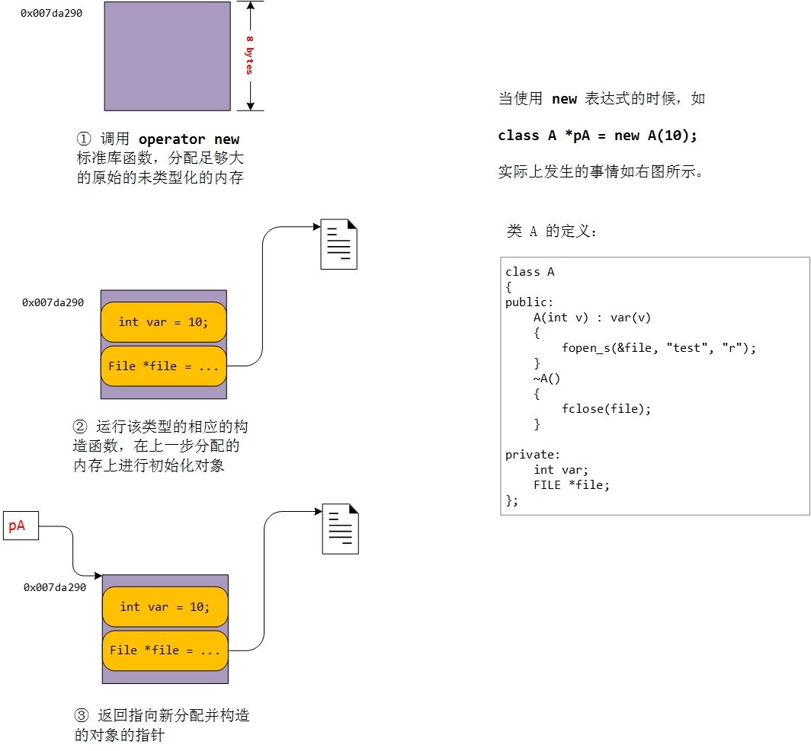
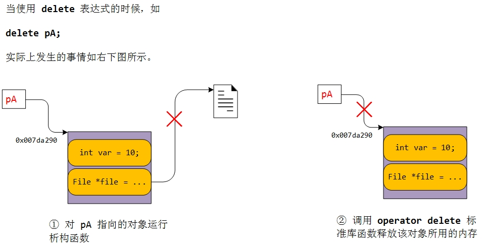
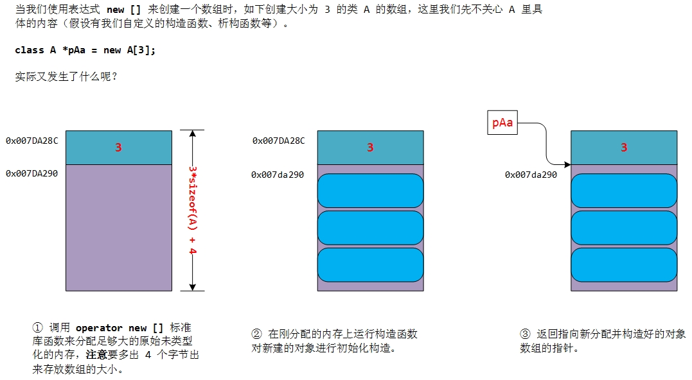
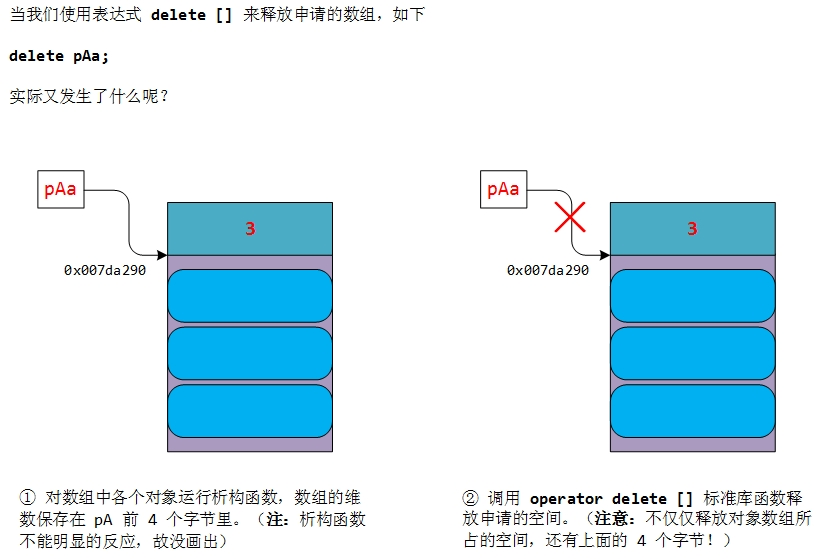

C++中的动态内存分配和释放
==========================

在C++中，对于一个变量或对象，我们使用\ ``new/delete``\ 来动态分配内存和释放；
对于数组，使用\ ``new []/delete []``\ 。

``new``\ 和\ ``delete``\ 到底是什么？
-------------------------------------

``sizeof``\ 不是函数，和\ ``sizeof``\ 类似，\ ``new``\ 和\ ``delete``\ 也不是函数，它们都是C++定义的关键字，通过特定的语法可以组成表达式。
和\ ``sizeof``\ 不同的是，\ ``sizeof``\ 在编译时就可以确定返回值，\ ``new``\ 和\ ``delete``\ 背后的机制则比较复杂。

继续往下之前，请你想想你认为\ ``new``\ 应该要做些什么?
也许第一反应是，\ ``new``\ 不就和C语言中的\ ``malloc``\ 函数一样嘛，就是用来动态申请内存空间的。
这只答对了一半，看看下面的语句：

.. code-block:: cpp

    string *ps = new string("hello, world");

就可以看出\ ``new``\ 和\ ``malloc``\ 还是有点不同的，\ **malloc申请完空间之后不会对内存进行必要的初始化，而new则会**\ 。
所以\ ``new expression``\ 背后要做的事情不是想象的那么简单。

在用实例来解释\ ``new``\ 背后的机制之前，我们需要知道\ ``operator new``\ 和\ ``operator delete``\ 是什么玩意。

``operator new``\ 和\ ``operator delete``
-----------------------------------------

这两个其实是C++语言标准库的函数，原型分别如下：

.. code-block:: cpp

    void *operator new(size_t);  // allocate an object
    void *operator delete(void *);  // free an object

    void *operator new;  // allocate an arrary
    void *operator delete;  // free an arrary

``operator new``/``operator delete``\ 这两个函数和C语言中的\ ``malloc``/``free``\ 函数类似，都是用来申请和释放内存的，
并且\ ``operator new``\ 申请内存之后不对内存进行初始化，直接返回申请内存的指针。

.. note::

    我们可以直接在程序中使用这几个函数。

``new``\ 和\ ``delete``\ 背后的机制
-----------------------------------

知道了上面的函数之后，我们用一个实例来解释\ ``new``\ 和\ ``delete``\ 背后的机制。

我们不用简单的C++内置类型来举例，使用复杂一点的类类型，定义一个类A：

.. code-block:: cpp

    class A
    {
    public:
        A(int v) : var(v)
        {
            fopen_s(&file, "test", "r");
        }

        ~A()
        {
            fclose(file);
        }

    private:
        int var;
        FILE *file;
    };

很简单，类A中有两个私有成员，有一个构造函数和一个析构函数，构造函数中初始化私有变量var以及打开一个文件，析构函数中关闭打开的文件。

我们使用

.. code-block:: cpp

    class A *pA = new A(10);

来创建一个类的对象，返回其指针\ ``pA``\ 。

如下图所示，\ ``new``\ 背后完成的工作：

简单总结一下：

-  首先，需要调用上面提到的\ ``operator new``\ 标准库函数，分配足够大的内存，\ ``operator new``\ 函数返回的是分配的内存的起始地址；

-  上面分配的内存是未初始化的，也是未类型化的，第二步就是在这一块原始的内存上对类对象进行初始化，调用的是相应的构造函数；

-  最后一步就是返回新分配并构造好的对象的指针。

好了，那么\ ``delete``\ 都干了什么呢？
还是接着上面的例子，如果这时想释放掉申请的类的对象怎么办？当然我们可以使用下面的语句来完成：

.. code-block:: cpp

    delete pA;

``delete``\ 所做的事情如下图所示：

``delete``\ 就做了两件事情：

-  调用对象的析构函数；

-  调用上面提到的标准库函数\ ``operator delete``\ 来释放该对象的内存。

好了，解释完了\ ``new``\ 和\ ``delete``\ 背后所做的事情了，是不是觉得也很简单？不就多了一个构造函数和析构函数的调用嘛。

.. note::

    * 如果一个类有自定义的构造函数，则在使用new创建对象时，在分配内存之后会调用相应的构造函数执行初始化操作；
      如果有自定义的析构函数，则在delete对象时，在释放内存之前会先调用相应的析构函数;

    * 如果new/delete分配和释放的是内置类型，或者是没有自定义构造函数/析构函数的类对象，则new/delete时不会调用构造函数/析构函数。

申请和释放数组
--------------

我们经常要用到动态分配一个数组，也许是这样的：

.. code-block:: cpp

    string *psa = new string[10];  // array of 10 empty strings
    int *pia = new int[10];  // array of 10 uninitialized ints

上面在申请一个数组时都用到了\ ``new []``\ 这个表达式来完成，
按照上面讲到的\ ``new``\ 和\ ``delete``\ 知识，第一个数组是\ ``string``\ 类型，分配了保存对象的内存空间之后，将调用\ ``string``\ 类型的默认构造函数依次初始化数组中的每个元素；
第二个是申请具有内置类型的数组，分配了存储10个int对象的内存空间，但并没有初始化。

如果想释放空间，可以用下面两条语句：

.. code-block:: cpp

    delete [] psa;
    delete [] pia;

都用到\ ``delete []``\ 表达式，注意这里的\ ``[]``\ 一般情况下不能漏掉！
可以想象这两条语句分别干了什么：
第一个对10个string对象分别调用析构函数，然后再释放掉为对象分配的所有内存空间；
第一个因为是内置类型不存在析构函数，直接释放为10个int型分配的所有内存空间。

这里对于第一种情况就有一个问题了：\ **我们如何知道psa指向对象的数组的大小？怎么知道调用几次析构函数？**

这个问题直接导致我们需要在\ ``new []``\ 一个对象数组时，需要保存数组的维度，
C++的做法是在分配数组空间时多分配4个字节的大小，专门保存数组的大小，
在\ ``delete []``\ 时就可以取出这个保存的数，就知道了需要调用多少次析构函数了。

还是用图来说明比较清楚，我们定义了一个类A，但不具体描述类的内容，这个类中有显式的构造函数，析构函数等。
那么当我们调用：

.. code-block:: cpp

    class A *pAa = new A[3];

时需要做的事情如下：

从这个图中我们可以看到，申请时在数组对象的上面还多分配了4个字节用来保存数组的大小，但是最终返回的是对象数组的指针，而不是所有分配空间的起始地址。

这样的话，\ ``delete []``\ 就很简单了：

.. code-block:: cpp

    delete []pAsa

这里要注意的两点：

-  调用析构函数的次数是从数组对象指针前面的4个字节中取出；

-  传入\ ``operator delete []``\ 函数的参数不是数组对象的指针\ ``pAa``\ ，而是\ ``pAa``\ 的值减4。

为什么\ ``new/delete``\ , \ ``new []/delete []``\ 要配对使用?
--------------------------------------------------------------

通过上面的解释，我们现在应该知道了\ ``new/delete``, ``new []/delete []``\ 的工作原理了，因为它们之间有差别，所以要配对使用。
但偏偏问题不是这么简单，如下这段代码：

.. code-block:: cpp

    int *pia = new int[10];
    delete []pia;

这肯定是没问题的，但如果把\ ``delete []pia``\ 换成\ ``delete pia``\ 的话，会出问题吗？

这就涉及上面一节提到的问题了。
上面我们提到了在\ ``new []``\ 时多分配4个字节的缘由，因为析构函数需要知道数组的大小，但如果不调用析构函数呢(如内置类型，这里的int数组)？
我们在\ ``new []``\ 时就没必要分配那4个字节，\ ``delete []``\ 时直接到第二步释放为int数组分配的空间。
如果这里使用\ ``delete pia``\ ，那么将会调用\ ``operator delete``\ 函数，传入的参数时分配给数组的起始地址，所做的事情就是释放掉这块内存空间。不存在问题的。

这里说的使用\ ``new []``\ 用\ ``delete``\ 来释放对象的前提是：对象的类型是内置类型或者是无自定义的析构函数的类类型！

我们看看如果是带有自定义析构函数的类类型，用\ ``new []``\ 来创建类对象数组，而用\ ``delete``\ 来释放会发生什么？用上面的例子来说明：

.. code-block:: cpp

    class A *pAa = new class A[3];
    delete pAa;

那么\ ``delete pAa``\ 做了两件事：

-  调用一次pAa指向的对象的析构函数

-  调用\ ``operator delete (pAa)``\ 释放内存

显然，这里只对数组的第一个类对象调用了析构函数，后面的两个对象均没有调用析构函数，
如果类对象中申请了大量的内存需要在析构函数中释放，而在销毁数组对象时少调用了析构函数，这会造成内存泄漏。

上面的问题你如果说没关系的话，那么第二点就是致命的了！
直接释放pAa指向的内存空间，这个总是会造成严重的段错误，程序必然会崩溃！
因为分配的内存空间的起始地址是pAa指向的那个地址减去4个字节的地址，你应该传入的参数是那个地址！

同理，可以分析如果使用\ ``new``\ 来分配，用\ ``delete []``\ 来释放会出现什么问题？是不是总会导致程序错误？

.. note::

    * 如果一个类有自定义的构造函数，则在使用new []创建对象数组时，在分配内存之后，会调用相应的构造函数，对数组的各个元素初始化；

    * 如果一个类有自定义的析构函数，在使用new []创建对象数组后，在释放对象数组的内存空间之前，需要先对数组的各个元素调用其析构函数；
      这就需要知道数组中有多少个元素，才能知道要调用多少次析构函数。
      为了解决这个问题，C++中采取的方法是，如果一个对象有自定义的析构函数，则在使用new []创建对象数组时，会多分配4个字节的空间，
      用以存储数组的大小，但是返回的是对象数组的起始地址，而不是所有分配的内存空间的起始地址；

    * 使用delete释放内存时，你给它一个指针，它就释放对应的动态内存空间，如果要释放的是类对象且有自定义的析构函数，则先执行其析构函数再释放内存；
      如果传递的指针不是之前动态分配时返回的地址，则因段错误导致程序崩溃；

    * 使用delete []释放内存时，它会先判断要释放的对象数组其元素是否有自定义的析构函数，
      如果有，就将当前传入的地址减4得到分配的内存空间的起始地址，得到数组元素的个数，为每个数组元素执行析构函数，之后释放分配的内存空间；
      如果要释放的对象数组其元素没有自定义的构造函数，则直接根据当前传入的地址释放动态分配的内存空间；

总的来说，记住一句即可：\ **new/delete, new []/delete []\ 要配对使用总是没错的！**

--------------

参考:

`浅谈C++中的new/delete和new[]/delete[] <https://www.cnblogs.com/hazir/p/new_and_delete.html>`__

