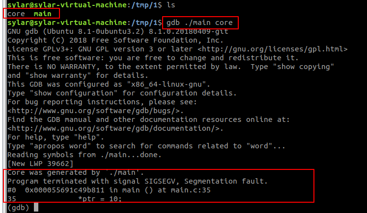

Linux下core dump
================

基本概念
--------

当程序在运行过程中异常终止或崩溃，操作系统会将程序当时的内存状态记录下来，保存在一个文件中，这种行为就叫\ **core dump**\ 。
我们可以认为core dump是"内存快照"，但实际上，除了内存信息之外，还有些关键的程序运行状态也会同时dump下来，
例如寄存器信息(包括程序指针，栈指针等)，内存管理信息，其他处理器和操作系统状态和信息。

core dump对于编程人员诊断和调试程序是非常有帮助的，因为对于有些程序错误是很难重现的，例如指针异常，而core dump文件可以再现程序出错时的情景。

开启core dump
-------------

可以使用命令\ ``ulimit``\ 开启，也可以在程序中通过\ ``setrlimit``\ 系统调用开启。

在终端中开启core dump
~~~~~~~~~~~~~~~~~~~~~

打开core dump功能
^^^^^^^^^^^^^^^^^

- 在终端中输入命令\ ``ulimit -c``\ ，输出结果为0，说明默认是关闭core dump的，即当程序异常终止时，也不会生成core dump文件；

- 我们可以使用命令\ ``ulimit -c unlimited``\ 来开启core dump功能，并且不限制core dump文件的大小；
  如果需要限制文件的大小，将\ ``unlimited``\ 改成你想生成的core文件的最大的大小，注意单位为blocks(KB)；

- 用上面的命令只会对当前的终端环境有效，如果想需要永久生效，可以修改文件\ ``/etc/security/limits.conf``\ 文件，在其中增加一行:

    .. code-block:: shell
        :emphasize-lines: 6

        # /etc/security/limits.conf
        #
        #Each line describes a limit for a user in the form:
        #
        #<domain>	<type>	<item>	<value>
      	  *		soft	core	unlimited

修改core文件保存的路径
^^^^^^^^^^^^^^^^^^^^^^

- 默认生成的core文件保存在可执行文件所在的目录，文件名为\ *core*\ ；

- 通过修改\ ``/proc/sys/kernel/core_uses_pid``\ 文件可以控制生成core文件名时是否自动加上pid号；

  例如，\ ``echo 1 > /proc/sys/kernel/core_used_pid``\ ，生成的core文件名将会变成\ ``core.pid``\ ，其中pid表示该进程的PID;

- 还可以通过修改\ ``/proc/sys/kernel/core_pattern``\ 来控制生成core文件保存的位置以及文件格式；

  例如，可以用\ ``echo "/tmp/corefile-%e-%p-%t" > /proc/sys/kernel/core_pattern``\ 设置生成的core文件保存在\ ``/tmp/corefile``\ 目录下，文件名格式为\ ``core-命令名-pid-时间戳``\ 。

在程序中开启core dump
~~~~~~~~~~~~~~~~~~~~~

在程序中开启core dump，使用如下的API:

.. code-block:: c

    #include <sys/resource.h>

    int getrlimit(int resource, struct rlimit *rlim);
    int setrlimit(int resource, const struct rlimit *rlim);

参考程序如下所示:

.. code-block:: c

    #include <unistd.h>
    #include <sys/time.h>
    #include <sys/resource.h>
    #include <stdio.h>

    #define CORE_SIZE 1024 * 1024 * 50

    int main()
    {
        struct rlimit rlmt;
        if (getrlimit(RLIMIT_CORE, &rlmt) == -1)
        {
            return -1;
        }
        printf("Before set rlimit CORE dump current is:%d, max is:%d\n", (int)rlmt.rlim_cur, (int)rlmt.rlim_max);

        rlmt.rlim_cur = (rlim_t)CORE_SIZE;
        rlmt.rlim_max = (rlim_t)CORE_SIZE;

        if (setrlimit(RLIMIT_CORE, &rlmt) == -1)
        {
            return -1;
        }

        if (getrlimit(RLIMIT_CORE, &rlmt) == -1)
        {
            return -1;
        }
        printf("After set rlimit CORE dump current is:%d, max is:%d\n", (int)rlmt.rlim_cur, (int)rlmt.rlim_max);

        /* 测试非法内存，产生core文件 */
        int *ptr = NULL;
        *ptr = 10;

        return 0;
    }

将上面的代码保存在名为main.c的文件中，编译生成可执行程序main:\ ``gcc -g main.c -o main``\ ；
执行main，默认在当前路径下会生成core文件。

当core dump之后，使用命令\ ``gdb program core``\ 来查看core文件，其中\ ``program``\ 为可执行程序，\ ``core``\ 为生成的core文件。

--------------

参考:

`linux下core dump <https://www.cnblogs.com/Anker/p/6079580.html>`__
