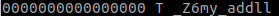

C/C++编译器的函数名修饰
=======================

在代码中定义了一个函数名称，经编译器编译，在生成的目标文件(库或可执行程序)中，该函数对应的名称并不是在代码中定义的那个名称，而是该函数的修饰名。

函数的修饰名称(Decorated Name)，就是编译器在编译期间创建的一个字符串，用来指定函数的定义或原型。

.. note::

    链接器在链接时，根据函数的修饰名称定位函数的位置。

在通常情况下程序员并不需要知道函数的修饰名称，链接程序或其它工具会自动区分它们。

* 根据使用的函数调用约定的不同，函数名修饰规则不同；

* C和C++的函数修饰规则不同。

查看函数编译后的修饰名
----------------------

在Linux系统中，可以使用\ ``nm``\ 命令查看编译后函数的修饰名。

例如，创建一个\ *test.cpp*\ 文件，在其中添加一个简单的函数:

.. code-block:: c++

    long my_add(long a, long b
    {
        return a+b;
    }

编译生成目标文件:

.. code-block:: c++

    g++ -o test.o -c test.cpp

查看符号表:

.. code-block:: shell
    :emphasize-lines: 1

    nm -s test.o

结果如下:

查看函数修饰名对应的原始函数名
------------------------------

在Linux系统中，可以使用\ ``c++filt``\ 命令查看函数修饰名对应的原始函数名。

在上面的例子中，查看得知函数修饰名为\ ``_Z6my_addll``\ ，使用下面的命令查看其对应的原始函数名:

.. code-block:: shell
    :emphasize-lines: 1

    c++filt _Z6my_addll

结果为:

编译器函数名修饰规则不匹配导致的问题
------------------------------------

编译程序，如果在链接时报错: ``unresolved external symbol ***``\ ，导致这个错误的原因，可能是没有链接特定的库。
如果链接了特定的库，编译器还是报这个错误，就有可能是因为编译库时的函数名修饰规则和链接库时的函数名修饰规则不一致。

例如，在动态链接库a中有导出函数: ``long MakeFun(long lFun)``\ ，动态库生成的时候采用的函数调用约定是\ ``__stdcall``\ ，所以编译生成的\ *a.so*\ 中函数MakeFun的修饰名称是\ ``_MakeFun@4``\ 。
模块b和a一样使用C++方式编译，只是b模块使用的函数调用约定是\ ``__cdecl``\ ；
模块b中包含了a提供的头文件中中MakeFun函数声明，但是由于b模块使用的函数调用约定是\ ``__cdecl``\ ，
所以链接时根据函数名修饰规则，链接器就会去a.so中查找\ ``?MakeFun@YGJJ@Z``\ ，但是a.so中只有\ ``_MakeFun@4``\ ，当然找不到，所以链接器就会报上面的错误。

解决方法就是\ **在库的编译和链接时，使用相同的函数调用约定**\ 。

